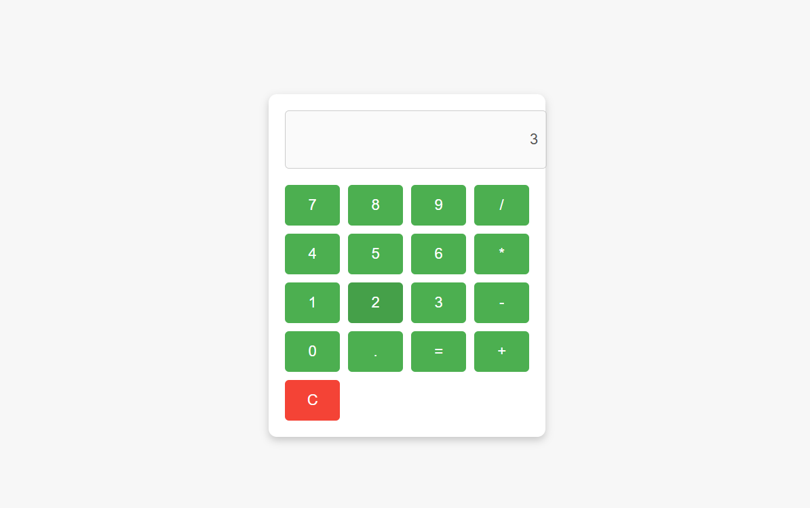

# Calculator App

This is a simple calculator application built using **Java**, **HTML**, **CSS**, and **JavaScript**. As a beginner, I created this project to enhance my programming skills and learn how to integrate a basic backend (Java) with a frontend (HTML/CSS/JavaScript).

## Features
- Perform basic arithmetic operations: addition, subtraction, multiplication, and division.
- Designed with a user-friendly interface.
- Backend functionality implemented in Java.

## Technologies Used
- **Java**: For backend logic.
- **HTML**: To create the structure of the application.
- **CSS**: For styling the user interface.
- **JavaScript**: To make the application interactive.

## Preview


> **Note:** Replace `path/to/your/image.png` with the actual path to your image. Upload your image to the repository first.

## How to Run the Project
1. Clone this repository to your local machine:
   ```bash
   git clone https://github.com/israfatima17/calculator-app.git
   cd calculator-app
